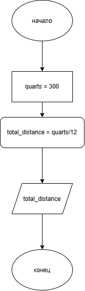

# Домашнее задание к работе 2

## Условие задачи

Мальчик может бегать в три раза быстрее, чем ходить. Скорость его ходьбы равна 4
км/час. Он принял участие в марафонском забеге, но сошел с дистанции, пробежав
только х км. Сколько времени он затратил на пре-одоление этого расстояния?

---

## 1. Алгоритм и блок-схема

### Алгоритм

1. Задать константы: скорость хотьбы `SPEED_PER_WALK = 4` км/ч
   и скорость бега `SPEED_PER_RUN = 3 * SPEED_PER_WALK` км/ч.
2. Запросить у пользователя дистанцию пройденую мальчиком в километрах (`quarts`).
3. Вычислить общее затраченное время: `total_distance = quarts / SPEED_PER_RUN` в ч и `total_time = total_distance * 60` в мин.
4. Вывести исходные данные, промежуточные расчёты и итоговое количество молекул.
5. Завершить программу.

### Блок-схема



---

## 2. Реализация программы
---

## 3. Результаты работы программы

Пример работы программы при вводе **20 километров** дистанции:

```
Введите количество килломаетров: 20

РАСЧЕТ КОЛИЧЕСТВА ЗАТРАЧЕННОГО ВРЕМЕНИ
================================

УСЛОВИЯ:
- Скорость хотьбы: 4.0 км/ч.
- Скорость бега: 12 км/ч.

РАСЧЕТ:
- Дистанция: 20 км.
- Общее затраченное время в часах: 20.00 км / 12 км/ч = 1.67 ч.
- Общее затраченное время в минутах: 1.67 ч * 60 = 100.00 мин.
================================
ВРЕМЯ ЗАТРАЧЕННОЕ НА ПРОЙДЕННУЮ ДИСТАНЦИЮ: 1.667 ч. или 100 мин
```

---

## 4. Информация о разработчике

- **ФИО:** Губский Данил Максимович
- **Группа:** бОТИ-261
